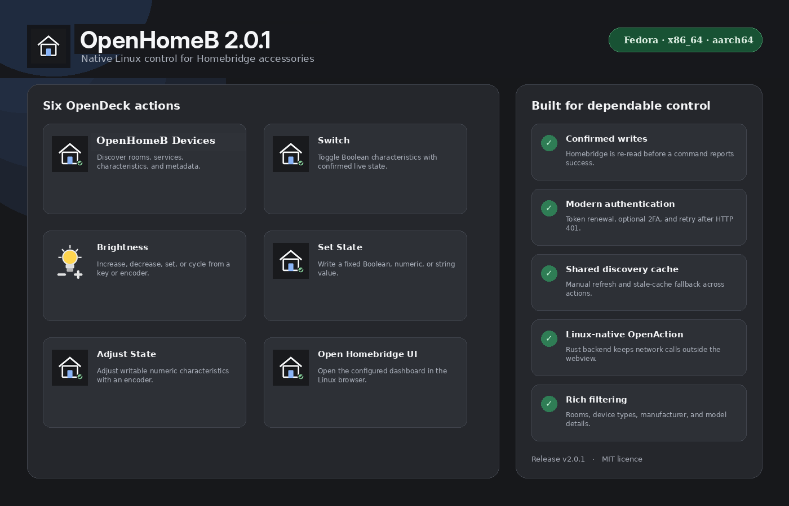
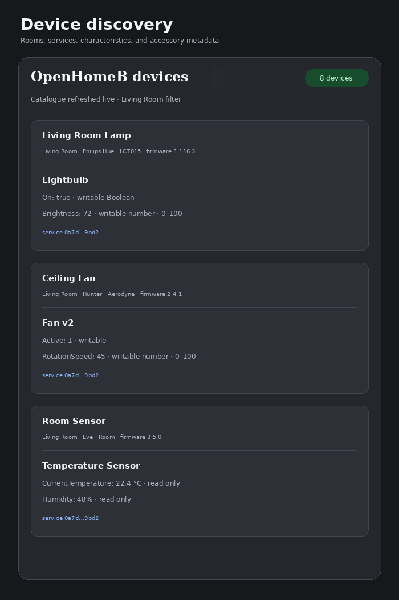
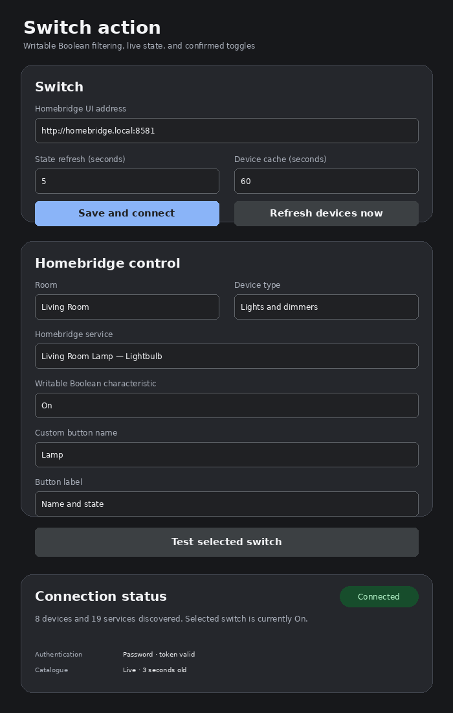
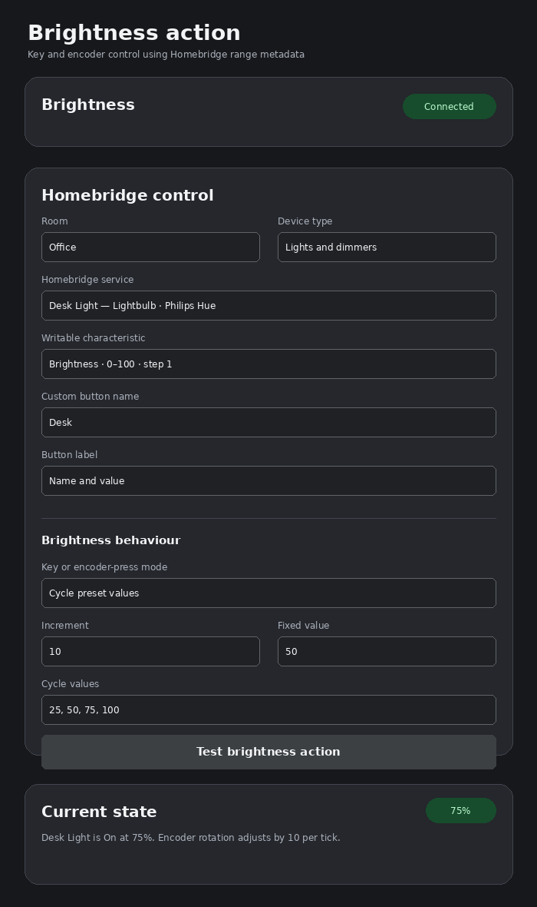

# OpenHomeB

A Linux-native OpenDeck/OpenAction plugin for discovering and controlling accessories exposed by Homebridge Config UI.

**Current version: 2.0.1**



<details>
<summary>Action screenshots</summary>







</details>

Version 2.0.1 includes the complete 2.0 feature set and release-build validation fixes. Version 2.0 expanded the working Switch implementation with dedicated brightness controls, shared discovery caching, proactive authentication renewal, richer device metadata, compatibility parsing, and configurable button labels.

## Highlights

- Native Linux support for Fedora Workstation 44.
- x86_64 and aarch64 package layouts.
- Shared Homebridge connection settings across all actions.
- Homebridge no-auth, username/password, and optional two-factor authentication.
- Proactive token renewal before expiry plus automatic retry after HTTP 401.
- Shared device-catalogue cache with configurable lifetime.
- Manual **Refresh devices now** command that bypasses the cache.
- Stale-cache fallback when a previously successful catalogue exists but Homebridge is temporarily unreachable.
- Room and device-type filtering.
- Manufacturer, model, serial number, and firmware metadata where Homebridge provides them.
- UUID-first characteristic matching with type fallback.
- Conservative compatibility parsing for current and selected legacy response structures.
- Periodic state refresh for visible Switch, Brightness, and Adjust State actions.

## Actions

| Action | Controller | Behaviour |
|---|---|---|
| **OpenHomeB Devices** | Keypad | Lists discovered devices, rooms, services, characteristics, and hardware metadata. |
| **Switch** | Keypad | Reads and displays a writable Boolean state, toggles it on `keyDown`, confirms the write, and refreshes periodically. |
| **Brightness** | Keypad or Encoder | Reads and displays brightness, increases/decreases/sets/cycles values on a key or encoder press, and adjusts relatively when an encoder is rotated. |
| **Set State** | Keypad | Writes a configured Boolean, number, or string to a writable characteristic. |
| **Adjust State** | Encoder | Adjusts any writable numeric characteristic using Homebridge min/max/step metadata. |
| **Open Homebridge UI** | Keypad | Opens Homebridge Config UI in the Linux default browser. |

## Rename and migration

OpenHomeB uses the new plugin and action namespace `com.infamous-pattern.openhomeb`. This fully removes the former project namespace from the codebase, but OpenDeck treats the renamed actions as new actions. After installing OpenHomeB, re-add each action to the desired key or encoder and select its Homebridge service again. The previous package can then be removed after the new actions are confirmed working.

## Homebridge requirements

1. Homebridge Config UI must be installed and reachable, normally on TCP port `8581`.
2. Homebridge must run in insecure mode (`-I`) for the Config UI accessory-control API to read and write characteristics.
3. Keep Homebridge and port `8581` on a trusted LAN; do not expose it directly to the internet.

## Build on Fedora Workstation 44

```bash
sudo dnf install -y rust cargo gcc zip
cd openhomeb
chmod +x scripts/*.sh
./scripts/build-fedora.sh
```

The installable package is created at:

```text
dist/com.infamous-pattern.openhomeb.streamDeckPlugin
```

The local build contains the architecture of the Fedora machine. The included GitHub Actions workflow builds and packages both supported Linux architectures.

## Install and connect

1. Install the generated `.streamDeckPlugin` file through OpenDeck's **Plugins** screen.
2. Add an OpenHomeB action to a key or encoder.
3. Enter the Homebridge UI address, such as `http://10.52.10.19:8581`.
4. Enter credentials only when Homebridge Config UI authentication is enabled.
5. Select **Save and connect**.
6. Use **Refresh devices now** when you need a guaranteed live discovery request.

Connection fields are not saved while they are being typed.

## Brightness action

The Brightness action only lists services with a readable and writable numeric `Brightness` characteristic.

### Key or encoder-press modes

- **Increase:** adds the configured increment.
- **Decrease:** subtracts the configured increment.
- **Set a fixed value:** writes the configured target.
- **Cycle preset values:** advances through a comma-separated list such as `25, 50, 75, 100`.

Rotating an encoder always adjusts brightness relatively. Values are aligned to Homebridge's `minStep` and clamped to `minValue` and `maxValue`. The action can optionally turn the service's writable `On` characteristic on when brightness is raised above minimum.

The plugin re-reads Homebridge after a write and reports an error rather than displaying success when the confirmed value does not change.

## Switch action

The Switch action:

1. Lists only services with readable/writable Boolean characteristics.
2. Resolves the selected characteristic by UUID first and type second.
3. Queries the current value.
4. Displays the current state using the configured label mode.
5. Calculates and writes the inverse value on `keyDown`.
6. Re-reads Homebridge until the requested state is confirmed or the command times out.
7. Automatically reauthenticates after a rejected token.

Available label modes are name and state, state only, name only, or hidden.

## Authentication diagnostics

The property inspector shows:

- Authentication method.
- Scheduled proactive token-refresh time.
- Token expiry information.
- Whether the catalogue is live, cached, or stale.
- Catalogue age and last-refresh time.

Token renewal occurs before the expiry reported by Homebridge. Reads and writes also invalidate the token and authenticate once more after HTTP 401.

## Shared device cache

All action property inspectors use one Rust-process catalogue cache. The default lifetime is 60 seconds and is configurable from 5 to 3600 seconds.

- **Save and connect** may use a fresh cached catalogue.
- **Refresh devices now** bypasses the cache.
- A failed live refresh can return the most recent cache marked as stale.
- Successful individual reads and writes update the matching service in the cache.

## Compatibility parsing

The current Homebridge `serviceCharacteristics` structure is preferred. The parser also recognises selected aliases and legacy structures such as a `characteristics` array or a `values` map.

Legacy values are never assumed writable merely because their names resemble `On` or `Brightness`. Write capability must be explicitly provided through permissions or a writable-characteristics list. This avoids controlling the wrong Boolean or numeric value.

## Device metadata and filtering

The property inspector displays manufacturer, model, serial number, and firmware revision when present in `accessoryInformation`. Selectors can be filtered by room and broad device type:

- Lights and dimmers
- Switches and outlets
- Fans
- Blinds and doors
- Thermostats
- Sensors

## Test without Homebridge

Start the included mock server:

```bash
./scripts/test-mock.sh
```

Use:

```text
http://127.0.0.1:8581
```

Authenticated mode:

```bash
./scripts/test-mock.sh --auth --username admin --password admin
```

Run the source-level validation suite:

```bash
node --check assets/propertyInspector/openhomeb.js
node test/test_property_inspector.js
python3 -m unittest discover -v
```

When Rust is installed:

```bash
cargo fmt --check
cargo test --all-targets
cargo clippy --all-targets -- -D warnings
```

## Security note

The current OpenAction settings API stores the Homebridge username and password in OpenDeck's global plugin settings. Protect the Fedora user account and OpenDeck configuration directory. Homebridge should remain restricted to a trusted network.

## Project layout

```text
assets/manifest.json                         OpenDeck action definitions
assets/propertyInspector/openhomeb.html     Property inspector UI
assets/propertyInspector/openhomeb.js       Discovery, settings, filtering, and diagnostics
src/homebridge.rs                            REST client, authentication, caching, and parsing
src/models.rs                                Settings and Homebridge data models
src/actions/brightness.rs                    Key and encoder brightness action
src/actions/switch.rs                        Boolean toggle and live state action
src/actions/set_state.rs                     Fixed-value action
src/actions/adjust.rs                        Generic numeric encoder action
src/actions/devices.rs                       Discovery action
src/actions/open_ui.rs                       Linux browser action
src/poller.rs                                Visible-action refresh loop
```

## Attribution

The functionality and user experience were independently designed with reference to the archived MIT-licensed `sergey-tihon/streamdeck-homebridge` project and the GPLv3 `ethanbanker/HomeBridge-StreamController-Plugin` project. No source code or binaries from either project are included. See `NOTICE.md`.
